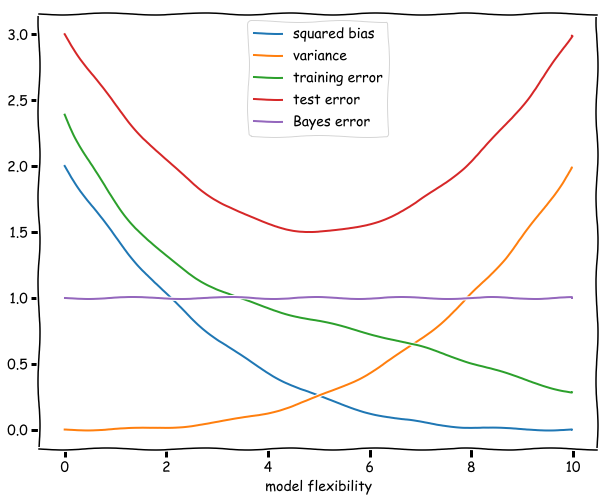

### 1. For each of parts (a) through (d), indicate whether we would generally expect the performance of a flexible statistical learning method to be better or worse than an inflexible method. Justify your answer.

(a) We would expect a flexible method to perform better than a less flexible method. Since *n* is large, the flexible method has less of a risk of overfitting and will be able to fit the shape of the data better because it has less bias. 

(b) We would expect a flexible method to perform worse than a less flexible method. Since *n* is small, a flexible method would have a much higher risk of overfitting the data. The inflexible method would be more biased but would be able to achieve more consistent performance on such small data. 

(c) We would expect the flexible method to perform better than a less flexible method. A flexible method will be able to fit the non-linear relationships more accurately as it has a lower bias. An inflexible method will not be able to properly capture the non-linearity of the data.

(d) We would expect the flexible method to peform worse than a less flexible method. The increased bias in the inflexible method will allow it to generate consistent predictions despite the high variance. The more flexible method will likely overfit to the noise. 

### 2. Explain whether each scenario is a classification or regression problem, and indicate whether we are most interested in inference or prediction. Finally, provide *n* and *p*.

(a) This is a **regression** problem because the target variable, CEO salary is quantitative. We are interested in which factors affect CEO salary, which is a goal of **inference**. This problem has *n* = 500 and *p* = 3.

(b) This is a **classification** problem because the target variable, success/failure, is qualitative. We are looking to **predict** whether the product is a success or failure. This problem has *n* = 20 and *p* = 13

(c) This is a **regression** problem because the target variable, %change in exchange rate, is quantitative. We are looking to **predict** the rate based on our features. This problem has *n* = 52 and *p* = 3. 

### 3. We now revisit the bias-variance decomposition.

(a) 

(b) **Squared bias**: This is the error in the model introduced by the difference of our estimate and the true underlying function. A more flexible model will be increasingly similar, and the squared bias will decrease as the flexibility increases.

**Variance**: In a model with no flexibility the variance will be zero, since the model fit will be independent of the data. As the flexibility increases the variance will increase as well since the noise in a particular training set will be increasingly captured by the model. The curve described by the variance is follows the increase in flexibility of the model.

**Training error**: The training error is given by the average (squared) difference between the predictions of the model and the observations. If a model is very unflexible, this can be very high, but as the flexibility increases this difference will decrease.

**Test error**: The test error will be high for highly biased models, as they are unlikely to accurately fit the data. It then decreases as flexibility increases until hitting a minimum where the model is adequately de-biased while not having too high of a variance. Then, as the variance increases with more flexibility the test error starts to rise again. The line resembles an upward parabola.

**Bayes error**: This term is constant since by definition it does not depend on X and therefore on the flexibility of the model.

### 4. You will now think of some real-life applications for statistical learn- ing.

(a) 1. Classifying a credit card transaction as fraudulent or not based on time, amount, location, etc. This would be a prediction problem because we are primarily concerned with properly estimating whether a transaction is fraudulent rather than figuring out what influences a transaction being fraudulent. 

    2. Classifying handwritten numbers based on the color values of pixels in the image. This would be a prediction problem as we are focused on correctly identifying what number was drawn. 

    3. Classifying an investment opportunity as favorable or not based on historical data. This could be either a prediction or inference problem as we could simply be looking to create an accurate tool for investors or we could look to better understand what makes companies successful. 

(b) 1. Predicting a person's income baseed on their characteristics (age, schooling, gender, race, etc.). This problem could also be an inference problem if we are looking to identify what factors most impact a person's lifetime earnings.

    2. Using regression to predict a stock's price in the future based on market factors and historical data. This is a prediction problem as we want to ensure that we get as close to the true price as possible. 

    3. Estimating click through rates of various headlines. This could be either prediction or inference depending on if we are trying to build a tool to write better headlines or if we are simply trying to understand what better headlines have in common. 

(c) 1. Market segmentation.

    2. Recommendation systems.

    3. Detecting outliers.

### 5. What are the advantages and disadvantages of a very flexible (versus a less flexible) approach for regression or classification? Under what circumstances might a more flexible approach be preferred to a less flexible approach? When might a less flexible approach be preferred?

A more flexible model is better for regresssion or classification as it is able to fit non-linear or complicated data more effectivley. However, it is also more prone to overfitting, as it may begin to fit the random noise in the data. However, less flexible models are simpler, take less time to train, and can be less computationally intensive. More flexible models are preferred when we have a large *n* and highly non-linear data. Inflexible models are preferred when we have a small *n* or very high variance data. 

### 6. Describe the differences between a parametric and a non-parametric statistical learning approach. What are the advantages of a para- metric approach to regression or classification (as opposed to a non- parametric approach)? What are its disadvantages?

Parametric methods make an underlying assumption about the relationship between our target and features. For example, linear regression assumes that there is a linear relationship between our Xs and y. Non-parametric methods do not make any assumptions about the shape of the data and instead simply try to fit each point as close as possible while maintaining the function's smoothness. The parametric approach is simpler and easier to train and can be much easier to interpret for inference tasks. However, if you choose the wrong underlying assumptions, the parametric method risks performing very poorly when trying to predict the data.

### 7. The table below provides a training data set containing six observations, three predictors, and one qualitative response variable.

| Obs. | X1 | X2 | X3 | Y |
|------|----|----|----|---|
| 1 | 0 | 3 | 0 | Red |
| 2 | 2 | 0 | 0 | Red |
| 3 | 0 | 1 | 3 | Red |
| 4 | 0 | 1 | 2 | Green |
| 5 | −1 | 0 | 1 | Green |
| 6 | 1 | 1 | 1 | Red | 

Suppose we wish to use this data set to make a prediction for Y when $X_1 = X_2 = X_3 = 0$ using K-nearest neighbors.

(a) 
| Obs. | Euclidian Distance |
|------|--------------------|
| 1 | 3 |
| 2 | 2 |
| 3 | $\sqrt{10}$ | 
| 4 | $\sqrt{5}$ |
| 5 | $\sqrt{2}$ |
| 6 | $\sqrt{3}$ | 

(b) With K=1, our prediction is Green because it is closest to observation 5, which is green. 

(c) With K=3, our prediction is Red because it is closest to observations 5, 6, and 2, which chooses Red (2-1).

(d) If the decision boundary is non-linear, we would expect a small K to perform better as it will allow the algorithm to draw more granular separations between data points. 
